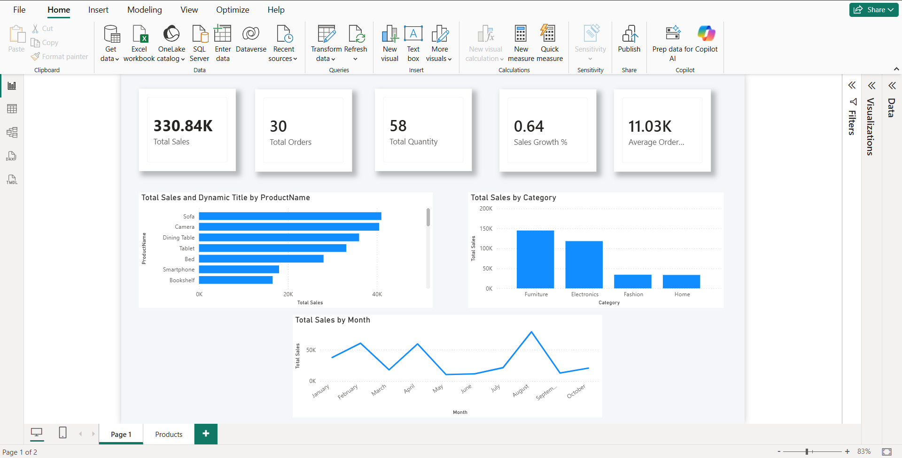
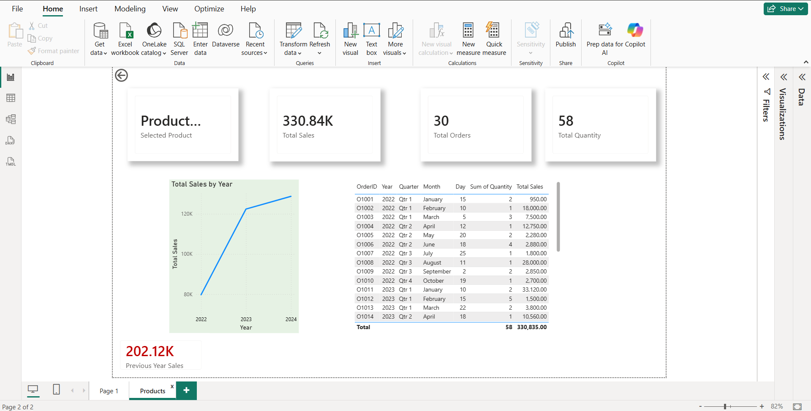

Project View:
             The project involves creating an interactive Sales Performance Dashboard using Power BI.
             The dashboard is designed to offer insights into sales, product, and business growth using a star schema data model.
Data Modeling:
            The project is based on a Star Schema data model:
            Fact Table: Orders
            Dimension Tables: Products, DateTable
            Disconnected Table: TopN Selector
            The data model is optimized for performance and DAX calculations.
Business Impact:
            This dashboard enables stakeholders to monitor revenue growth, identify top-performing products, and make data-driven decisions.
            ## 📷 Dashboard Preview

            
Key Features:
           KPI Cards (Total Sales, Orders, Quantity, Growth %)
           Time Intelligence (Year-over-Year Growth)
           Dynamic Top N Analysis using RANKX
           Drillthrough to Product Details
           Professional Visual Layout
Skills Used:
           Data Modeling (Star Schema)
           DAX Measures
           Time Intelligence Functions
           Dynamic Ranking
           Visual-Level Filtering
           Drillthrough Implementation

Author:
Bandaru Saathwik
